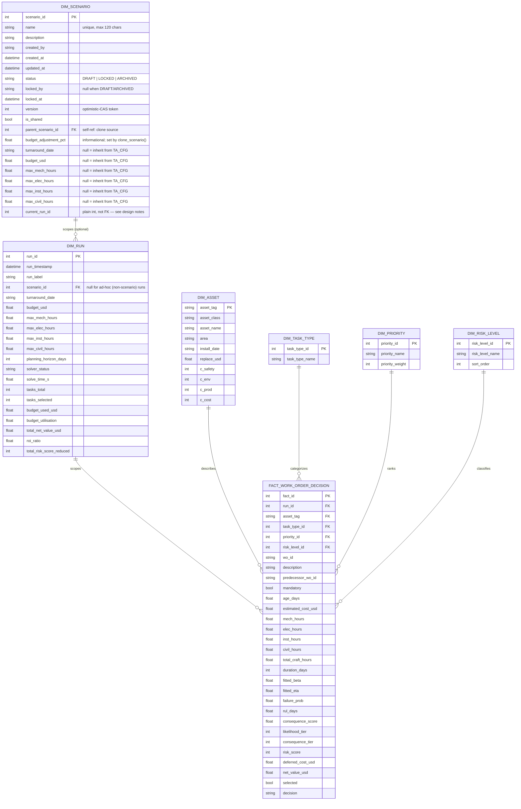

# Database Schema

The optimizer persists every run into a star schema — one fact table
surrounded by six dimension tables (including the new `dim_scenario`
collaboration layer) — rather than a single flat dump. This document is the
schema reference; see [`power_bi/README.md`](../power_bi/README.md) for how
to connect Power BI to it, and [`src/db/schema.py`](../src/db/schema.py) for
the SQLAlchemy ORM source of truth.

## Why a star schema instead of one flat table

A flat dump (every column from every pipeline stage in one wide table) is
the path of least resistance for a single export, but it breaks down the
moment more than one run needs to be compared: asset attributes
(replacement value, consequence ratings) would be duplicated once per run
they appear in, any correction to an asset's attributes would require
updating every historical row, and Power BI's relationship-based filtering
and DAX context propagation work against a star schema far more naturally
and performantly than against one denormalized sheet.

`dim_run` is the dimension that makes this genuinely useful rather than
just "normalized for its own sake" — every execution of the optimizer
(different budget, different craft-hour caps, a different turnaround date)
is its own row, so a single Power BI report can slice any visual by
scenario and build a live budget-sensitivity page from real stored history.

`dim_scenario` sits one level above `dim_run` — it is the collaborative
planning container that multiple planners share. A scenario can exist before
it is ever solved (draft parameters), be solved multiple times (each solve
adds a `dim_run` row), and be compared side-by-side with any other scenario
via `src/scenarios/comparison.py`. See §Scenario vs. Run below.

## Entity-relationship diagram

## Design notes

**Grain of the fact table**: one row per `(run_id, wo_id)`. The same work
order legitimately appears in multiple rows if it was evaluated across
multiple runs/scenarios — its `selected`, `net_value_usd`, and other
per-run measures can differ between runs even though it's the same
physical task.

**Scenario vs. Run**: `dim_run` is an immutable, append-only execution record
— every solve adds one row and existing rows are never edited. `dim_scenario`
is the mutable, collaborative container planners actually work in. It can
exist with no runs yet (a draft), accumulate multiple runs as the planner
iterates, and be locked while one planner is mid-edit. `current_run_id`
always points at the most recent solve, which is what
`compare_scenarios(engine, sid_a, sid_b)` compares. Ad-hoc runs (every
existing test, every plain `run_optimizer.py` invocation without
`--scenario-id`) set `dim_run.scenario_id = NULL` and remain fully
supported — the scenario system is additive, not a replacement.

**`dim_scenario.current_run_id` is NOT a foreign key**: This column points
at a `dim_run` row, but is declared as a plain `Integer`. The reason is the
circular-dependency problem: `dim_run.scenario_id` is already a FK pointing
at `dim_scenario`, so a FK pointing back from `dim_scenario.current_run_id`
to `dim_run.run_id` creates a cycle. SQLite's `ALTER TABLE` cannot add a
FK constraint to an existing table at all, and this project targets all four
backends identically. The invariant ("current_run_id always names a dim_run
row that has this scenario's scenario_id") is guaranteed by construction —
it is set in exactly one place: `src/scenarios/runner.py::solve_scenario()`,
immediately after `write_results_to_db()` commits.

**`dim_scenario.status` is a String, not a SQL ENUM**: SQLite has no native
ENUM type; Postgres, MySQL, and SQL Server each use different ENUM syntax.
A portable `String(12)` column validated at the single application layer
that writes it (`src/scenarios/manager.py`) avoids three different ENUM
dialects. Valid values are defined in `ScenarioStatus` constants: `DRAFT`,
`LOCKED`, `ARCHIVED`.

**`version` column and optimistic concurrency**: Every write to
`dim_scenario` goes through a single `UPDATE ... WHERE version = :expected`
statement that atomically increments the version. If the row was already
modified by another writer between the read and the write, `rowcount == 0`
and `ScenarioConflictError` is raised. This closes the TOCTOU race that the
advisory lock (`status`/`locked_by`) alone cannot prevent — two processes
can both read `status = DRAFT` before either writes `LOCKED`. See
`src/scenarios/manager.py::_compare_and_swap_update`.

**`dim_asset` holds only stable identity attributes** — asset tag, class,
name, area, replacement value, and consequence ratings. It deliberately
does **not** include `age_days` or `failure_prob`, because those are
run-dependent (a different `turnaround_date` changes age; different
failure history changes the fitted probability). Those values live in the
fact table, where the grain is correct for them.

**SQLite-specific behavior**: SQLite has no native boolean type — `bool`
columns (`mandatory`, `selected`) are stored as, and read back as, the
integers `0`/`1`. This is enforced behavior, not a SQLAlchemy abstraction
leak you need to work around in Python (SQLAlchemy's ORM still gives you
real Python `bool` values on read), but it **does** matter the moment you
query the database directly via raw SQL or via Power BI's Python-script
connector — see the callout in
[`power_bi/measures.dax`](../power_bi/measures.dax).

**Foreign-key enforcement**: SQLite has FK constraints **disabled** by
default, unlike Postgres/MySQL/SQL Server. `src/db/connection.py` enables
`PRAGMA foreign_keys=ON` on every SQLite connection specifically so the
relationships drawn above are actually enforced by the database, not just
documented as a convention — verified directly in
`tests/test_db.py::TestSchemaCreation::test_foreign_keys_enforced_on_sqlite`.

**The `latest_run_facts` view**: a plain SQL view (`SELECT * FROM
fact_work_order_decision WHERE run_id = (SELECT MAX(run_id) FROM
dim_run)`), recreated after every write. Exists purely as a convenience so
the simplest possible Power BI import — "just give me the current
schedule" — needs zero DAX filtering. The full fact table remains
available separately for any report that intentionally compares across
runs.

## Swapping the backing database

Nothing in `schema.py`, `writer.py`, or `queries.py` is SQLite-specific —
they're pure SQLAlchemy Core/ORM. Point `DATABASE_URL` (or `--database-url`
on the CLI) at Postgres, MySQL, or SQL Server instead, and everything above
applies identically; see [`power_bi/README.md`](../power_bi/README.md)
Option D for the production deployment path, which also gets you a native
(no-ODBC) Power BI connector and full Power BI Service scheduled-refresh
support.

